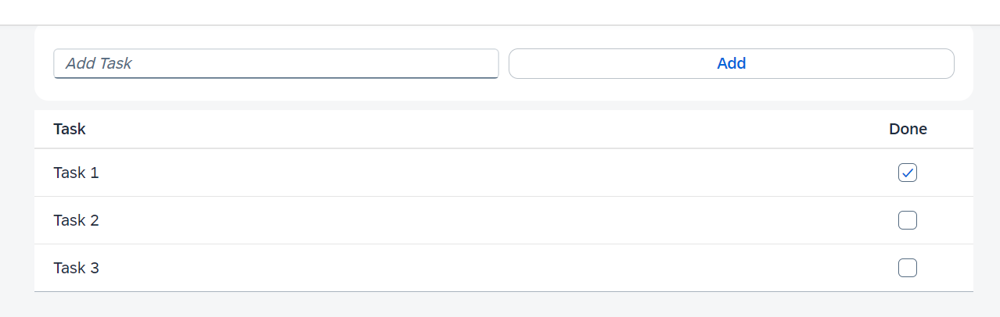

# Simple ToDo Application in UI5

In this tutorial, you will learn how to build a simple Todo-App in UI5, from creating the TypeScript project to the end.

---

#### Preview:



---

#### Setting up the Project

When starting a new UI5 TypeScript project it is recommended that you use the `easy-ui5` generator.

To install the generator you can use the following terminal command:
`npm install -g yo generator-easy-ui5`

After that, to create the TypeScript project you need to run the `yo easy-ui5 ts-app` command.
The generator should walk you through all the important settings for the project.

---

#### Coding

Once the project was successfully installed, we can start in the `view/Main.view.xml` file and define what controls we want to be displayed.

We start by setting the Pages title property to "Simple TODO-APP".  
After that, we start by defining which controls should be displayed within the page. To do that, we first need to delete the pre-generated code, between the `<content></content>` tags.

Now your code should look something like this:

```xml
<mvc:View
	controllerName="com.myorg.myapp.controller.Main"
	displayBlock="true"
	xmlns="sap.m"
	xmlns:mvc="sap.ui.core.mvc"
	xmlns:core="sap.ui.core"
	core:require="{
		formatter: 'com/myorg/myapp/model/formatter'
	}">

	<Page
		title="Simple TODO-App"
		id="page">
		<content>
			
		</content>
	</Page>

</mvc:View>
```

Since we want all of our content to be centered on the screen as well as aligned vertically, we are going to use a `<VBox ></VBox>` as our layout container. To achieve the horizontal center alignment, we the the VBoxes `alignItems` property to `"Center"`.

Next, we want the user to be able to enter text into a input field and the add a task by pressing a button.

For that we add a `SimpleForm` control. Since the `SimpleForm` control is inside the `sap.ui.layout.form` namespace, we need to include that namespace inside of our XMLs root tag. We do it like that: `xmlns:form="sap.ui.layout.form"`. Inside the Form we need to add to controls: a `Input` and a `Button`. We set the Inputs placeholder property to "Add task" and the Buttons text property to "Add". We are also going to set the Buttons `press` property to ".onButtonAddPress". This enables us to call a function in our controller and therfore handle user input.

Now your code should look something like this:

```xml
<mvc:View xmlns:form="sap.ui.layout.form"
	controllerName="com.myorg.myapp.controller.Main"
	displayBlock="true"
	xmlns="sap.m"
	xmlns:mvc="sap.ui.core.mvc"
	xmlns:core="sap.ui.core"
	core:require="{
		formatter: 'com/myorg/myapp/model/formatter'
	}">
	<Page
		title="Simple TODO-App"
		id="page">
		<content>
			<VBox alignItems="Center">
				<form:SimpleForm >
					<Input placeholder="Add Task" id="inpTask"></Input>
					<Button text="Add" press=".onButtonAddPress"></Button>
				</form:SimpleForm>
			</VBox>
		</content>
	</Page>
</mvc:View>
```

Below the SimpleForm closing tag, we now add the definition of our table of tasks. The definition of our table should look something like this:

```xml
<Table width="50rem" class="sapUiTinyMargin" id="taskTable">
	<columns>
		<Column >
			<header>
				<Text text="Task"></Text>
			</header>
		</Column>
		<Column width="5rem">
			<header>
				<Text text="Done"></Text>
			</header>
		</Column>
	</columns>
</Table>
```

We now pretty much completed the XML part of our TODO-App and we are now going to move on to the Main.controller.ts. We start by deleting the `sayHello` method. Then we are going to implement the `onButtonAddPress` function, that is called, whenever the user presses the Add-Button. As a parameter our function takes a `oEvent: Event` of type "sap/ui/base/Event".

```ts
public onButtonAddPress(oEvent: Event){
    
}
```

We first start, by getting the table and input field by their id and storing them in variables.

```ts
const taskTable: Table = this.byId("taskTable") as Table;
const inputTask: Input = this.byId("inpTask") as Input;
```

Then start building our table entry. We do that by creating a instance of the `ColumnListItem` control and storing it in a variable. Inside the constructor, we pass the settings as a TypeScript Object. Within that object, there is an array of cells. In that array, we create on instance of the `Text` control, as well as the `CheckBox` control

```ts
const tableEntry: ColumnListItem = new ColumnListItem({
    cells: [
        new Text({ text: inputTask.getValue() }),
        new CheckBox()
    ]
})
```

As a final step, we need to add the table entry to the table, and clear the input field. Once that is done, your `onButtonAddPress` function should look something like this:

```ts
public onButtonAddPress(oEvent: Event){
    const taskTable: Table = this.byId("taskTable") as Table;
    const inputTask: Input = this.byId("inpTask") as Input;

    const tableEntry: ColumnListItem = new ColumnListItem({
        cells: [
            new Text({ text: inputTask.getValue() }),
            new CheckBox()
        ]
    })

    taskTable.addItem(tableEntry);
    inputTask.setValue("")
}
```